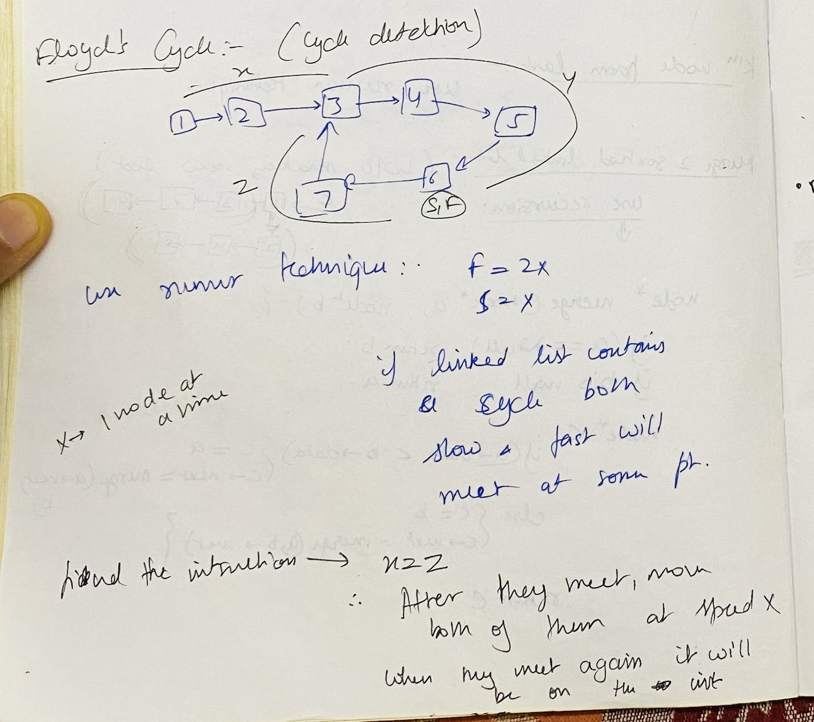

# Misc Topics

## Array

### [Encode and Decode Strings](https://leetcode.com/problems/encode-and-decode-strings/description/) ⭐️
> You are given a list of strings. You need to encode it into a single string and then you need to decode it back into the list of strings. Strings can contain any character.

- Saw solution
- `["aman","garg"] -> "4aman4garg"` what if size of a string is more than 1 digit?
- `["aman","amangargamangarg","garg"] -> "4#aman12#amangargamangarg4#garg"`

### [Longest Consecutive Sequence](https://leetcode.com/problems/longest-consecutive-sequence/description/) ⭐️⭐️
> Given an unsorted array of integers nums, return the length of the longest consecutive elements sequence. 

- Saw solution
- Store all elements in a set
- now traverse the list and see if you have all the next elements required to make the consecutive list. (make sure pre element does not belong in set so you only check when element is at the beginning)

## 2Pointer

### [Two Sum II - Input Array Is Sorted](https://leetcode.com/problems/two-sum-ii-input-array-is-sorted/description/) ⭐️
> Given sorted array and target. Find `(i,j)` such that `num[i] + num[j] = target`
- 2 pointers, move left if less than target, move right if more than target

### [3Sum](https://leetcode.com/problems/3sum/description/) ⭐️
> Given an array `nums` you need to find all unique triplets (nums[i],nums[j],nums[k]) triplets suich that all indices are different and numbers sum to `0`
- Many ways to do

### [Container With Most Water](https://leetcode.com/problems/container-with-most-water/description/) ⭐️⭐️
> Given an array of nums, each num represents a verticle line at $i^{th}$ coordinate. Find the pair of lines which can hold max amount of water together

- Area formed between the lines will always be limited by the height of the shorter line. 

- We take two pointers, i=0 & j=n-1. At every step, we find out the area formed between them, update maxarea, and move the pointer pointing to the shorter line towards the other

### [Trapping Rain Water](https://leetcode.com/problems/trapping-rain-water/description/) ⭐️
> Given n non-negative integers representing an elevation map where the width of each bar is 1, compute how much water it can trap after raining.

- for each `i` store leftMax and rightMax column length

## Sliding Window

### [Best Time to Buy and Sell Stock](https://leetcode.com/problems/best-time-to-buy-and-sell-stock/description/) ⭐️
> You are given an array prices where prices[i] is the price of a given stock on the ith day.
You want to maximize your profit by choosing a single day to buy one stock and choosing a different day in the future to sell that stock.
Return the maximum profit you can achieve from this transaction. If you cannot achieve any profit, return 0.

- was able to O(n) anf O(n) space sol
- Kadane's algorithm
- I couldnt think of a constant space sol on my own

``` java
public int maxProfit(int[] prices) {
    int n = prices.length;
    int l = 0;
    int r = 1;
    int res = 0;
    
    while(r<n){
        if(prices[l] < prices[r]){
            res = Math.max(res, prices[r] - prices[l]);
            r++;
        }
        else {
            l = r;
            r++;
        }
    }
    return res;
}
```

### [Longest Substring Without Repeating Characters](https://leetcode.com/problems/longest-substring-without-repeating-characters/description/) ⭐️

>Given a string s, find the length of the longest 
substring without repeating characters.

- Kinda frustrating, no major trick, saw sol, used set

### [Longest Repeating Character Replacement](https://leetcode.com/problems/longest-repeating-character-replacement/description/) ⭐️⭐️

> You are given a string s and an integer k. You can choose any character of the string and change it to any other uppercase English character. You can perform this operation at most k times. Return the length of the longest substring containing the same letter you can get after performing the above operations.

- Kinda hard
- Saw sol

### [Permutation in String](https://leetcode.com/problems/permutation-in-string/description/)

> Return true if one of s1's permutations is the substring of s2

- Able to think on my own
- Create a rolling hash or compare hashmaps

### [Minimum Window Substring](https://leetcode.com/problems/minimum-window-substring/description/) ⭐️

> Given two strings s and t of lengths m and n respectively, return the minimum window substring of s such that every character in t (including duplicates) is included in the window. If there is no such substring, return the empty string ""

- Able to think on my own
- Take pointers i,j 
- Move j untill all required characters are covered, then move i to shorten the window as much as possible
- How to check if our window is valid? We can do this is constant time without checking for each each character. See sol of neetcode (Maintain a count variable to see how many unique characters we need to satify)

### [Sliding Window Maximum](https://leetcode.com/problems/sliding-window-maximum/description/) ⭐️

> You are given an array of integers nums, there is a sliding window of size k which is moving from the very left of the array to the very right. You can only see the k numbers in the window. Each time the sliding window moves right by one position. Return the max value in sliding window.

- Able to think on my own immediately
- Have a deque all numbers in a way that deque is always decreasing from left to right. deque's leftmost element is always the biggest value in current window


## Stack

### [Min Stack](https://leetcode.com/problems/min-stack/description/) ⭐️
> Design a stack that supports push, pop, top, and retrieving the minimum element in constant time.

- Was able to think on my own but soluton was slightly better

### [Largest Rectangle in Histogram](https://leetcode.com/problems/largest-rectangle-in-histogram/description/) ⭐️⭐️⭐️
> Given an array of integers heights representing the histogram's bar height where the width of each bar is 1, return the area of the largest rectangle in the histogram.

- Hard ques, Requires revision from time to time

## Linked List

### [Reverse Linked List](https://leetcode.com/problems/reverse-linked-list/description/) ⭐️

- Struggled on this due to lack of practise

``` java
public ListNode reverseList(ListNode head) {
    ListNode curr = head;
    ListNode pre = null;

    while(curr != null){
        ListNode temp = curr.next;
        curr.next = pre;
        pre = curr;

        if(temp == null) return curr;
        curr = temp;
    }
    return null;
}
```

### [Linked List Cycle II](https://leetcode.com/problems/linked-list-cycle-ii/description/) ⭐️⭐️

> Given the head of a linked list, return the node where the cycle begins. If there is no cycle, return null.

- Start both `slow` and `fast` from `head`
- Once `fast` and `slow` pointers meet, move `slow` to `head` and then move both `fast` and `slow` one node at a time, they will meet at junction



### [Find the Duplicate Number](https://leetcode.com/problems/find-the-duplicate-number/description/) ⭐️⭐️⭐️

> Given an array of integers `nums` containing `n + 1` integers where each integer is in the range `[1, n]` inclusive. There is only one repeated number in nums, return this repeated number.

- Vaiation of above question. Difficult to think on your own

### [LRU Cache](https://leetcode.com/problems/lru-cache/description/) ⭐️⭐️⭐️

- Use Double linked list and hashmap

### [Merge k Sorted Lists](https://leetcode.com/problems/merge-k-sorted-lists/description/) ⭐️

- Use heap of list nodes

### [Reverse Nodes in k-Group](https://leetcode.com/problems/reverse-nodes-in-k-group/description/) ⭐️⭐️⭐️

- No trick, just grind and being careful about logic

