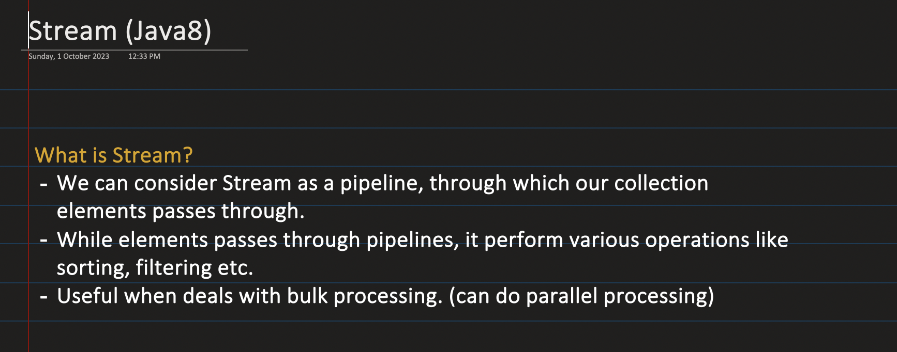
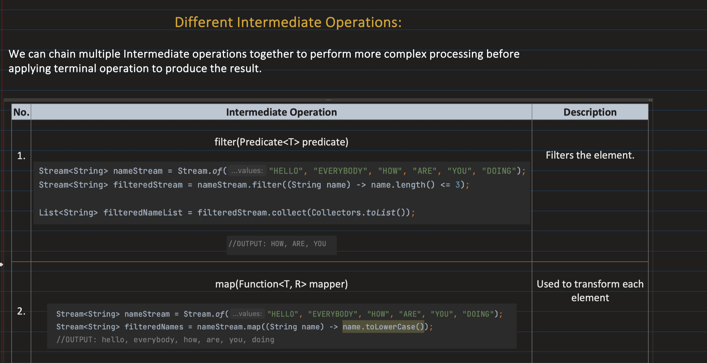
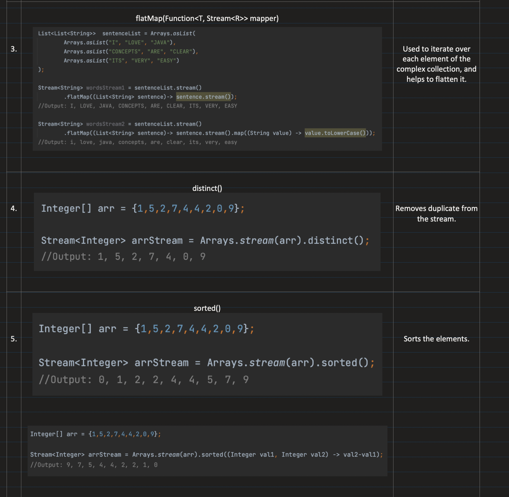
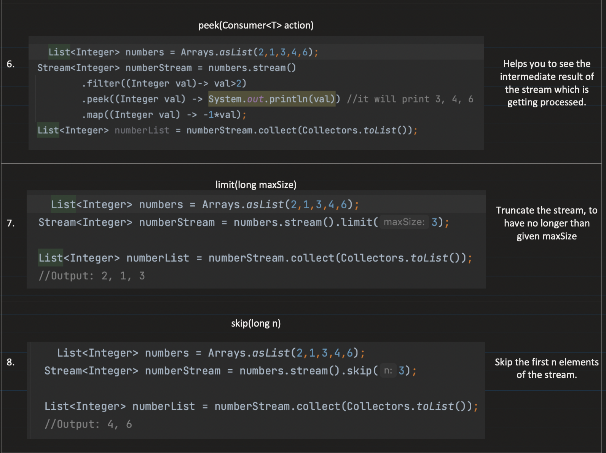
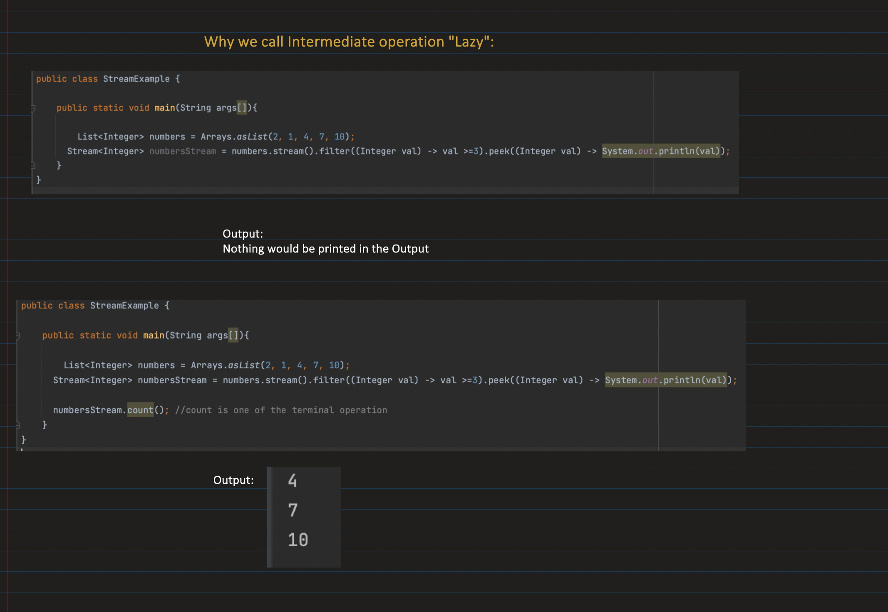
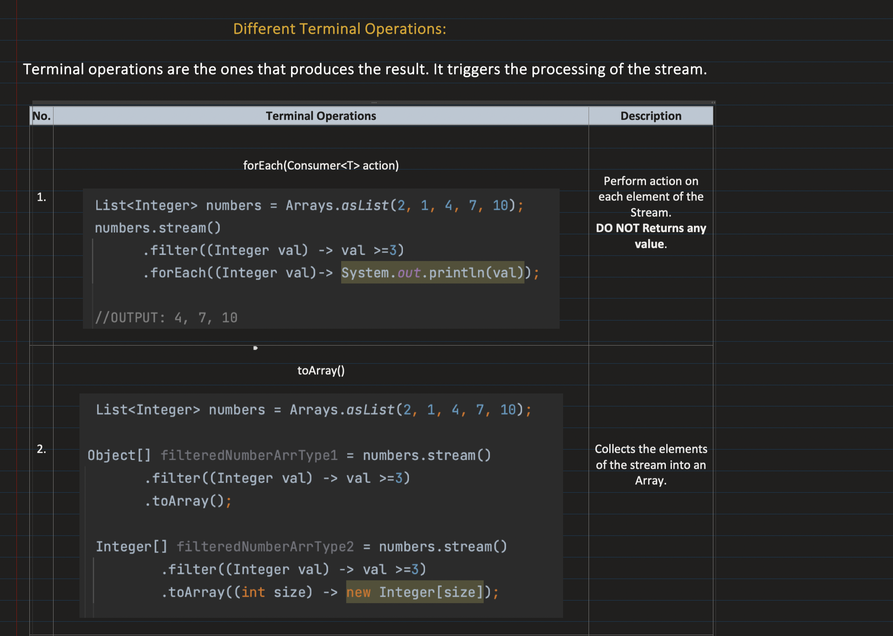
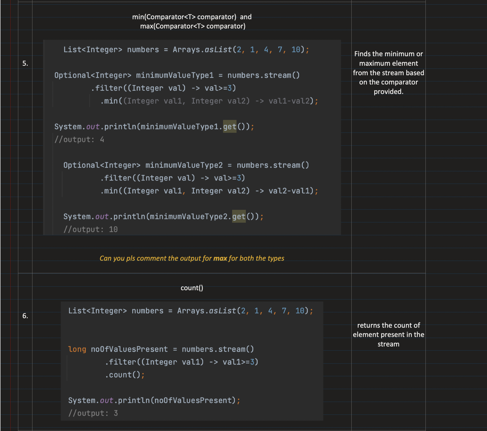
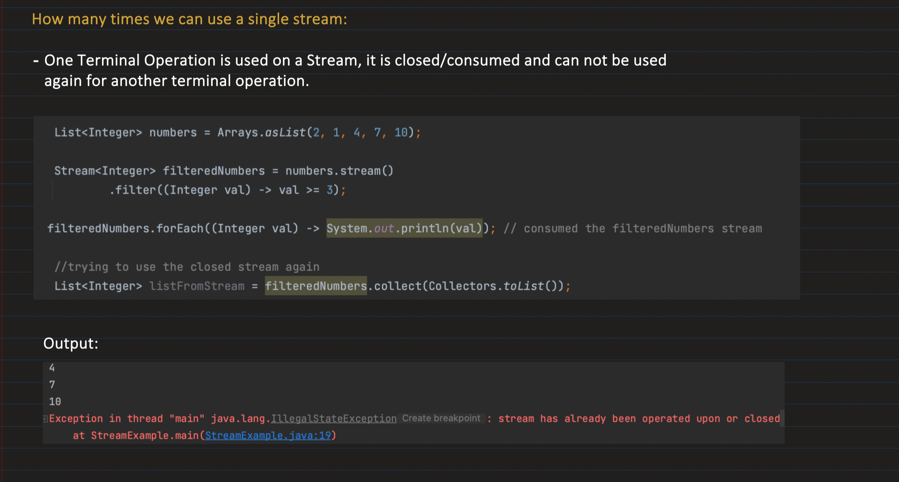
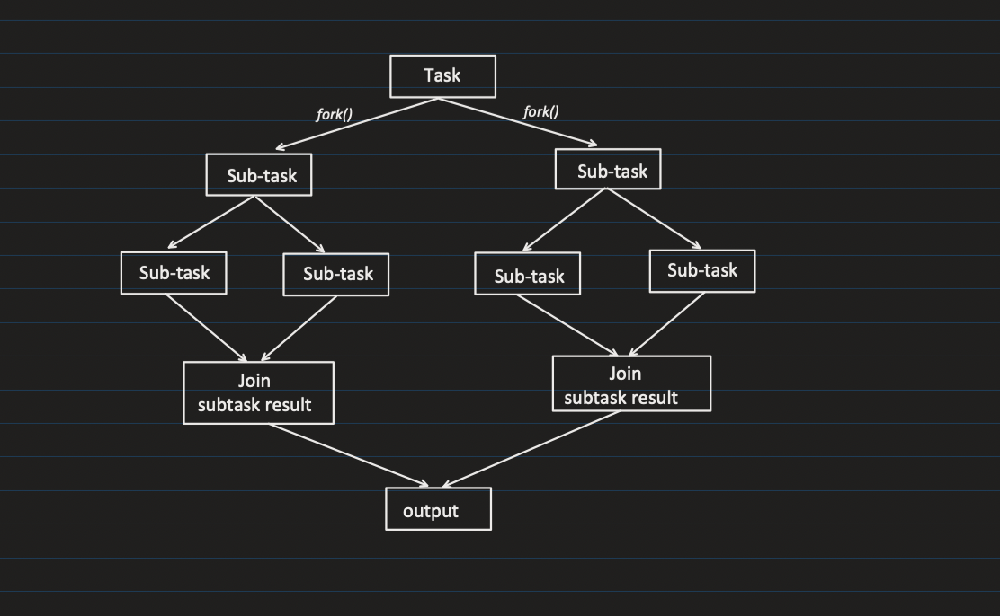

## [28. Streams in Java8 | Collections in Java - Part7](https://youtu.be/nEno48RpDR4?si=L6D0xMEpLXE2MqWd)

[Notes link](https://notebook.zohopublic.in/public/notes/74tdod05928d081b5484fbfd5937d4129fa64)

