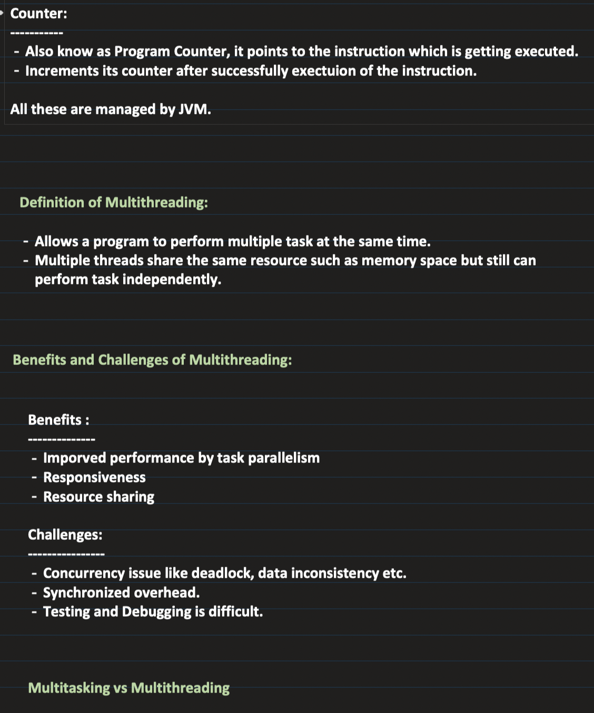

## [29. Multithreading and Concurrency in Java: Part1 | Threads, Process and their Memory Model in depth](https://www.youtube.com/watch?v=TpYIcJN9EV8&ab_channel=Concept%26%26Coding-byShrayansh)

[Notes link](https://notebook.zohopublic.in/public/notes/74tdo52a4834de5554f09bc9ec3f11572cd11)

