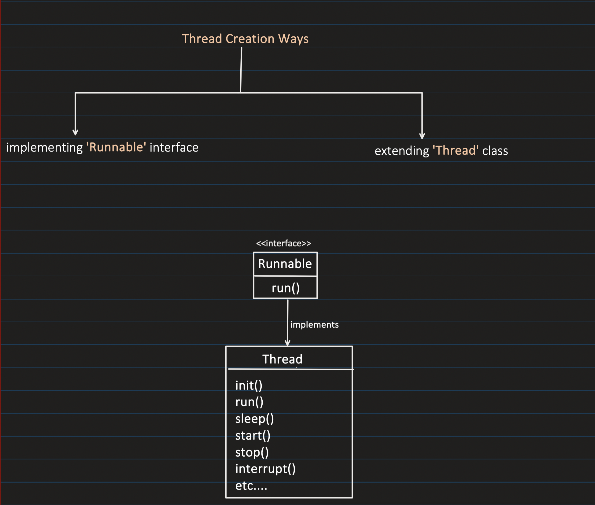
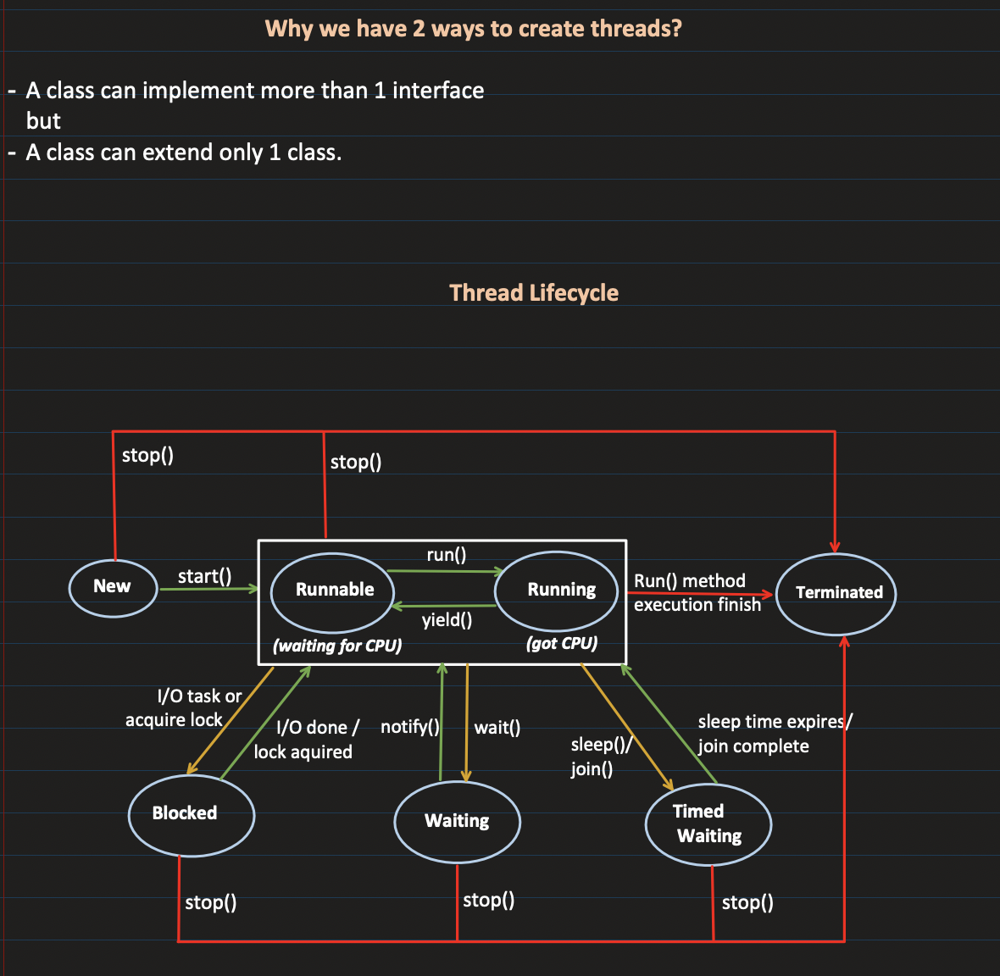
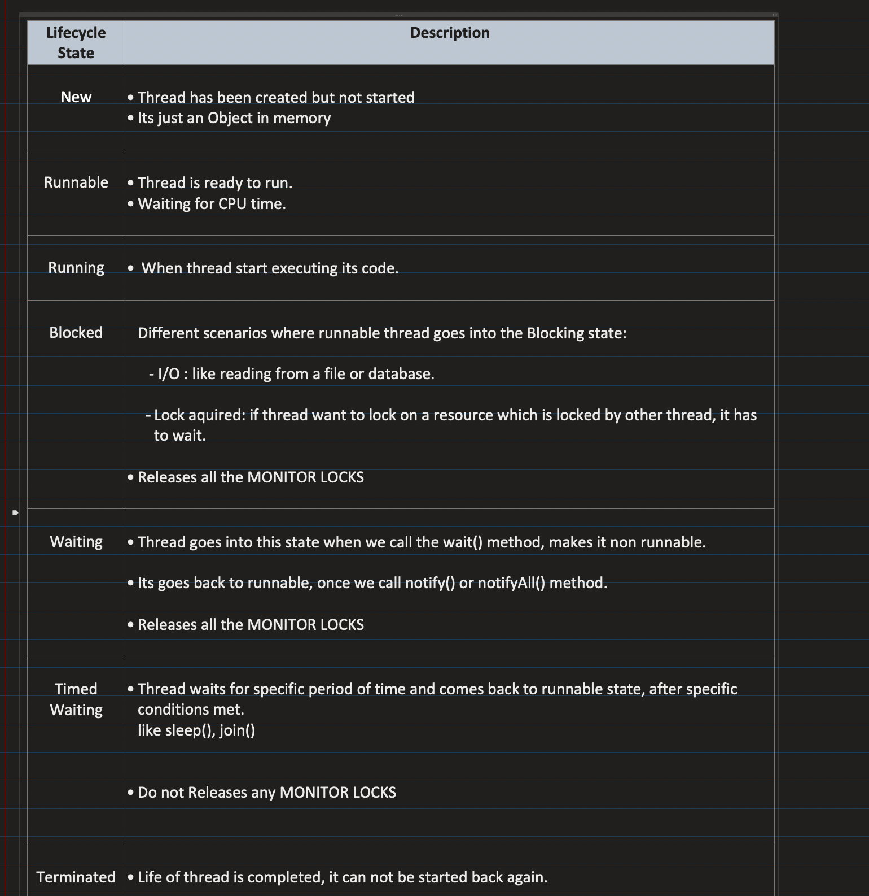
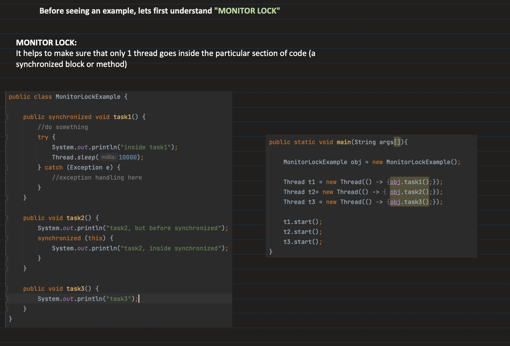
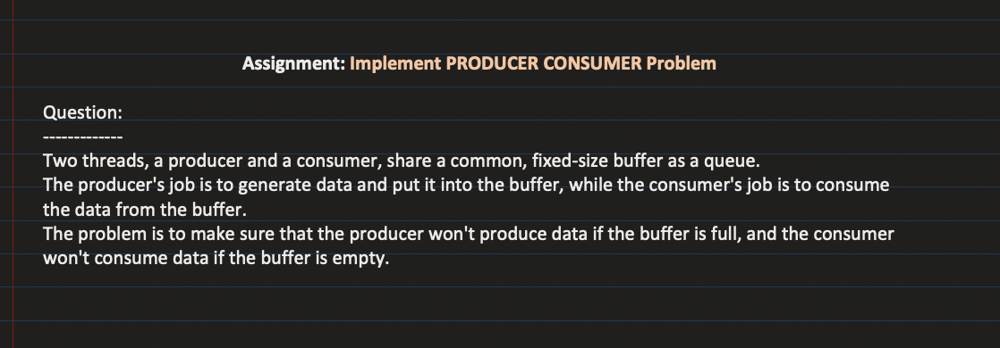

## [30. Thread Creation, Thread Lifecycle and Inter-Thread Communication | Multithreading in Java: Part2](https://www.youtube.com/watch?v=AYiE7_loIsE&ab_channel=Concept%26%26Coding-byShrayansh)

