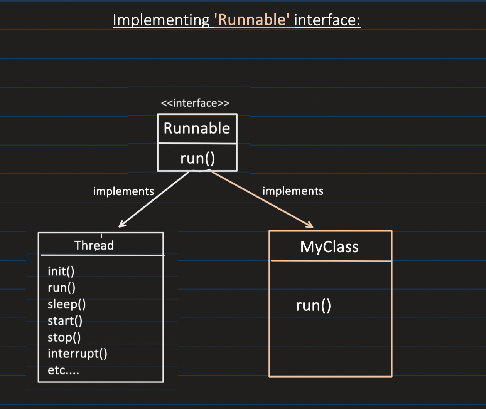
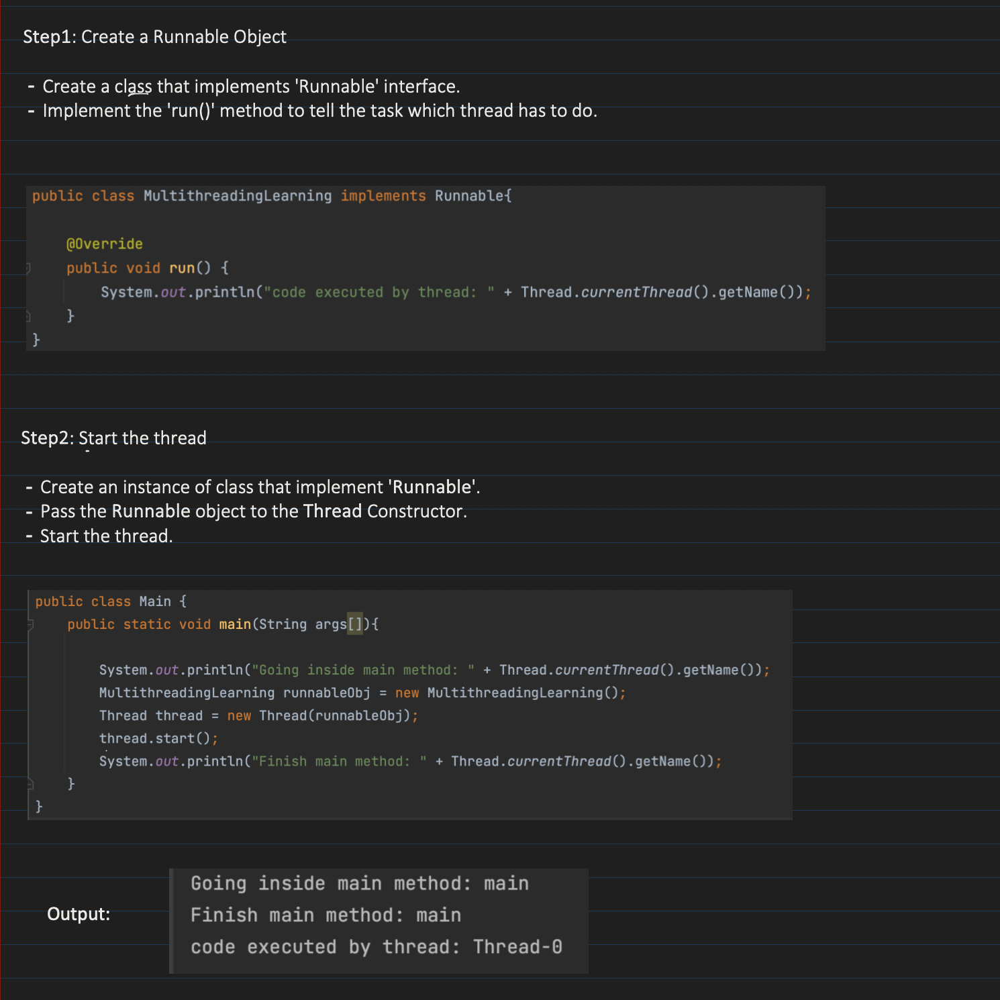

## [30. Thread Creation, Thread Lifecycle and Inter-Thread Communication | Multithreading in Java: Part2](https://www.youtube.com/watch?v=AYiE7_loIsE&ab_channel=Concept%26%26Coding-byShrayansh)

## Note: [👆 Monitor Lock will be at object level. Multiple sync blocks will be shared at object level]()
 

