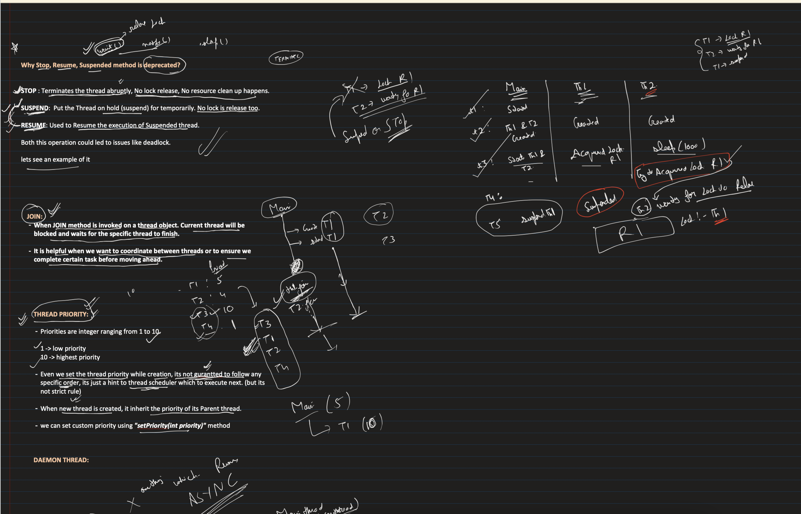

## [31. Thread Joining, Daemon Thread, Thread Priority | Multithreading in Java: Part3](https://youtu.be/cdsFwGDVzpg?si=6k3N-QZEBKtF82A8)

## Daemon thread 
- User thread vs Daemon thread 
- Daemon thread is alive only until there is atleast one user thread alive
- Uses: 
  - Garbage collector is a daemon thread
  - Auto save feature
