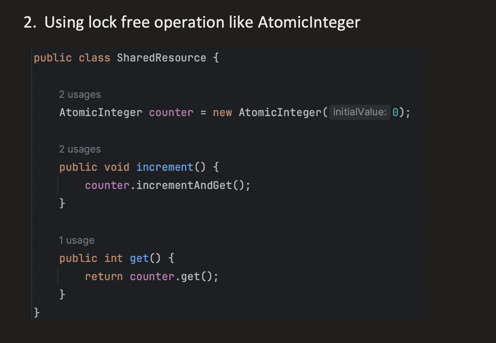
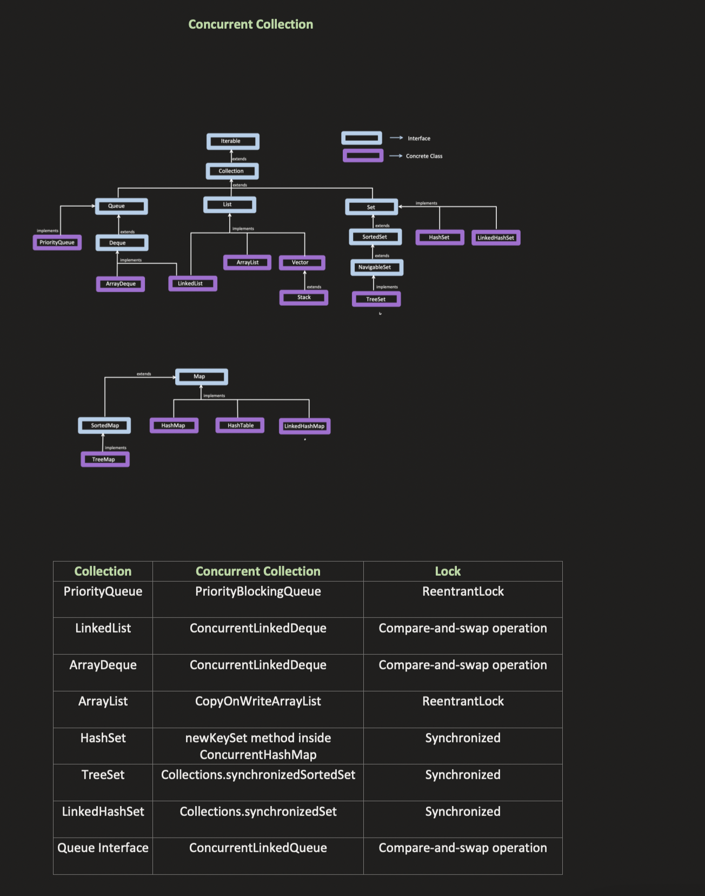

## [33. Lock-Free Concurrency | Compare-and-Swap | Atomic & Volatile Variables | Multithreading Part5](https://youtu.be/JGb4qNEBW6Q?si=oFoSKuF_1N7P1QYU)

## Volatile vs Atomic 
- Volatile has no relation with thread safetly
- Volatile ensures that read/write happens from RAM rather than l1/l2 cache as they may not have latest data among multiple cores

