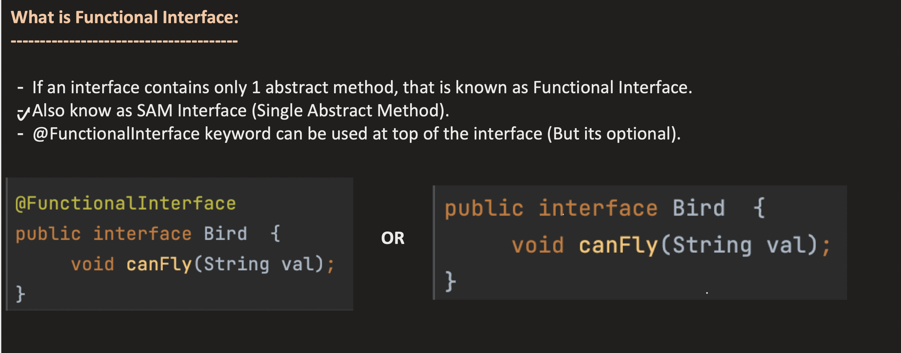
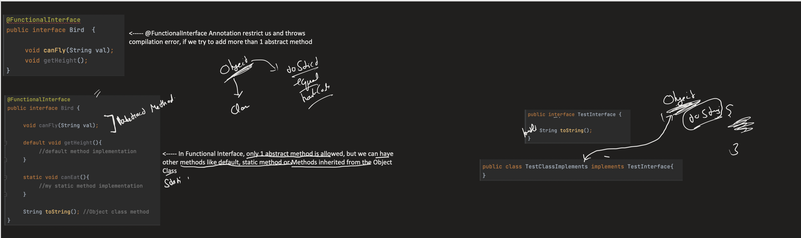
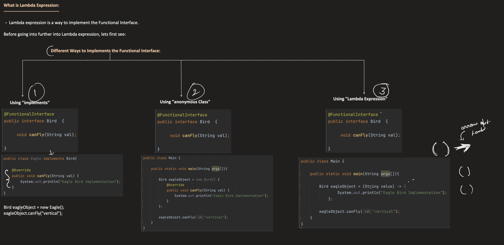

## [16. Functional Interface and Lambda Expression - Java8 features | Java Interfaces Part3](https://www.youtube.com/watch?v=YXRBBOjgrFU&list=PL6W8uoQQ2c63f469AyV78np0rbxRFppkx&index=18&ab_channel=Concept%26%26Coding-byShrayansh)

[Notes Link](https://notebook.zohopublic.in/public/notes/u3i1sa79b68153abe44d5aa93cc1d5b9f4dd9)

