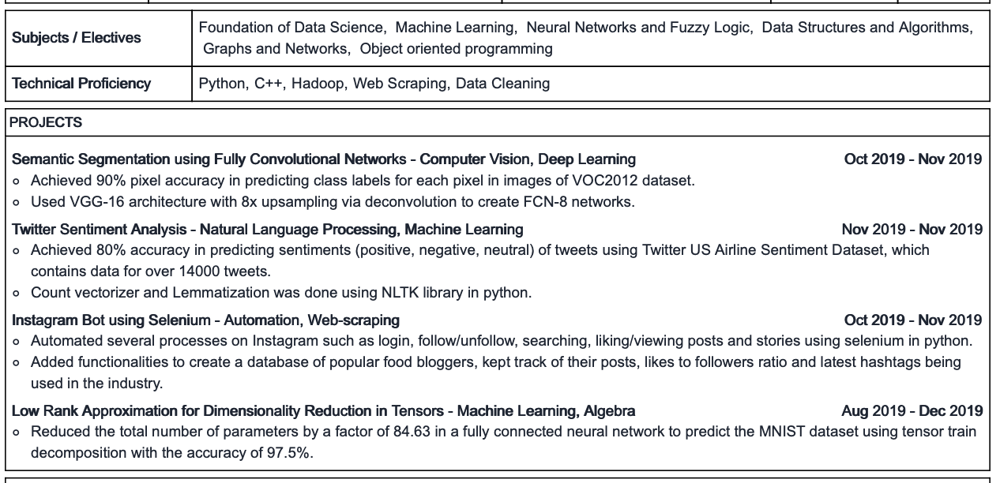

# ML Models

## Supervised Learning
Series of functions that maps an input to output (e.g. mapping features of a house to predict its price)

### Regression
Find a target value based on independent variables. Output is continous

- Linear regression
  - Multiple linear regression (finding a plane)
  - Polynomial regression (Finding a curve)

- Decision Tree 
- Random Forests (Multiple Desc Trees)
- Neural Network

### Classification

- Logistic Regression (Funct where out is between 0 and 1)
- SVM : Support Vector Machine (find hyperplane to divide data points)
- Naive Bayes
- KNN (target value will be the average of K nearest neighbours)

## Unsupervised Learning
Find patterns in inout data without any ref to outcome

### Clustering
- K Means

### Dimentionality Reduction
feature elimination / feature extraction

- PCA: Principal Component Analysis

## Reinforcement Learning

  

---
---
---

### Interesting Terms

- Elbow method for optimum number of clusters
- Feature engineering
- Normalization techniques to bring all the features to a certain scale
- Precision is simply the ratio between the true positives(TP) and all the positive examples (TP+FP) predicted by the model
- Recall, we calculate the ratio of true positives (TP) and the total number of examples (TP+FN) that actually fall in the positive class.
- upsampling and downsampling
- data leakage?
- covariance and correlation
- confusion matrix
- stochastic gradient descent (SGD) and gradient descent (GD)
- Central Limit theorem
- Define epoch, iterations, and batches

  

---
---
---

### My Experience

- Semantic Segmentation using Fully Convolutional Networks
- College project on CNN : Classification of drone shorts of arricultural land
- College Courses: Machine Learning, Data science, Neural networks, Fuzzy logic, Optimisation, Graphs and Networks, Discrete mathematics

